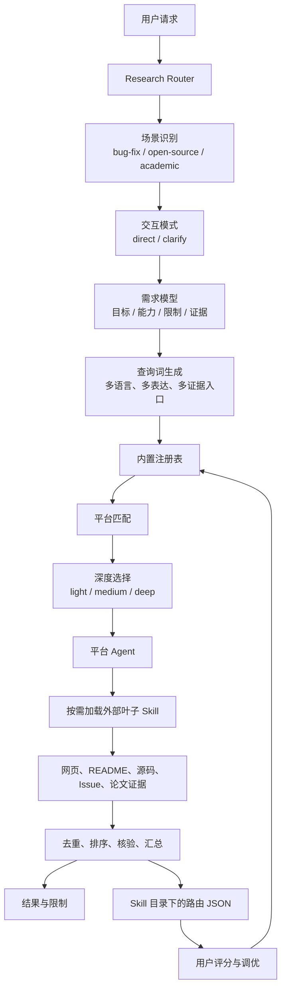
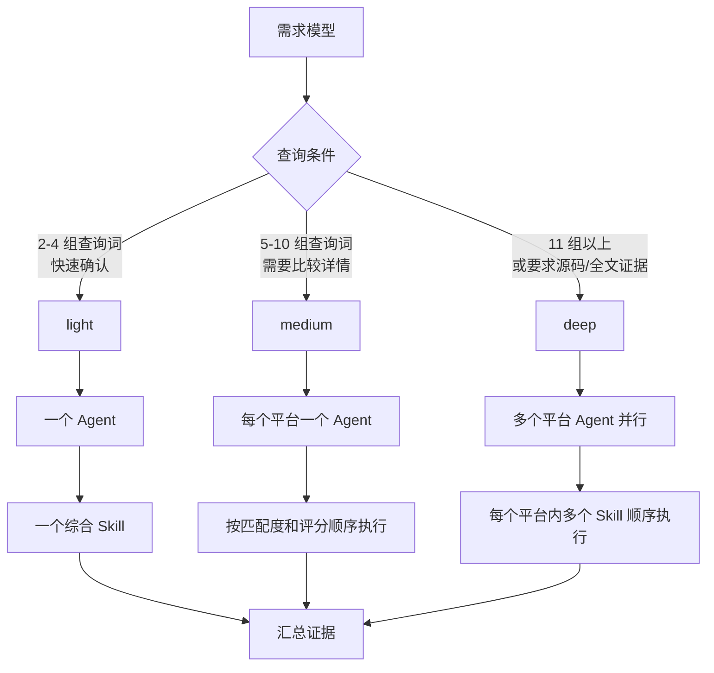
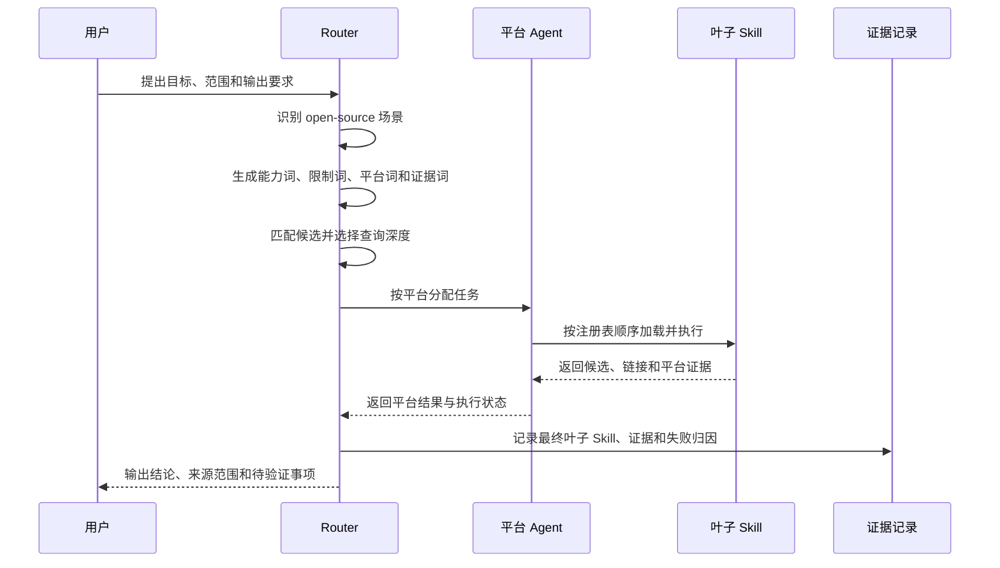

# Research Router

一个独立的 Codex Skill，用于把联网查询按“场景 → 交互模式 → 查询深度 → 平台 → 子 Skill”组织起来。

它适合放在 Codex 或其他支持 `SKILL.md` 的 Agent 宿主中，作为联网调研的入口。Router 只负责理解需求、选择路径和汇总证据，平台访问由命中的外部 Skill 完成。

## 为什么需要它

长任务中最容易出现三类偏移：

1. 把用户的真实目标压缩成一个宽泛关键词，只搜索项目标题，漏掉 README、源码和 Issue 中的有效候选。
2. 没有区分快速初筛、跨平台比较和源码/全文核验，所有任务都走同样的深度，浪费时间和上下文。
3. 只报告“调用过某个 Skill”，没有记录最终实际使用的叶子 Skill、失败原因和用户评分，下一次无法调整路径。

Research Router 将这些决策固定成可阅读的注册表和参考规则。每次路由都可以回答：

```text
为什么判定为这个场景？
为什么使用这个深度？
为什么选择这些平台和 Skill？
实际运行到了哪个叶子 Skill？
证据来自哪里？哪里仍然没有验证？
```

它面向三类查询：

- **bug-fix**：查找报错解决方案、Issue、修复提交、源码和回归测试。
- **open-source**：发现和比较开源项目、Skill、插件及其实际实现。
- **academic**：发现论文、作者和会议，并在需要时核验论文正文或 PDF 证据。

## 一句话流程


## 设计原则

1. 先识别查询场景，再选择查询深度。
2. 查询深度由需求派生词数量、证据要求和并行程度决定；平台数量由用户需求决定。
3. `light` 优先使用一个综合多平台 Skill；`medium` 按平台分配 Agent；`deep` 并行多个平台 Agent。
4. 一个 Agent 负责一个平台。同一平台命中多个 Skill 时，由该 Agent 按顺序执行。
5. Router 只按需加载叶子 Skill，不扫描全部本地 Skill，不要求 MCP 作为直接依赖。
6. GitHub 的源码结论需要继续读取目录、源码、依赖、测试、Issue 和 Release；论文证据需要核对正文或 PDF。
7. 每次路由记录实际执行到的最终子 Skill；用户评分与 Router 评分、子 Skill 评分分别保存。

## 总体架构



### Router 与叶子 Skill 的边界

| 组件 | 负责内容 | 不负责内容 |
| --- | --- | --- |
| Router | 场景判断、需求拆解、查询词集合、深度、平台 Agent、去重、记录和调优入口 | 复制第三方 Skill、保存凭据、把静态注册当成运行成功 |
| 综合平台 Skill | 多个平台的搜索、读取和结果整理 | GitHub 源码级结论、论文正文证据的最终核验 |
| 平台专项 Skill | 某个平台的详情、评论、互动或特殊接口 | 替代 Router 的全局路径决策 |
| GitHub 分析 Skill | 目录、源码、依赖、测试、Issue、Release 和提交关系 | 仅凭标题或 README 下结论 |
| 学术核验 Skill | 元数据、正文、PDF 和引用位置核对 | 将搜索摘要直接当作论文结论 |

## 快速安装

将本仓库安装为 Codex Skill：

```bash
npx skills add sxyq/research-router --skill research-router
```

本地手动使用：

```bash
git clone https://github.com/sxyq/research-router.git "${CODEX_HOME:-$HOME/.codex}/skills/research-router"
```

安装后，在 Codex 中可以直接使用：

```text
使用 $research-router 先判断这个查询属于修 Bug、开源项目发现还是论文查询，再按合适深度执行，并记录最终调用的子 Skill。
```

## 目录结构

```text
research-router/
├── SKILL.md                         # Codex 入口规则
├── agents/openai.yaml               # Codex 显示信息与默认提示
├── registry/                        # 内置平台和 Skill 注册表
│   ├── aliases.json                 # 平台别名归一化
│   ├── platforms.index.json         # 平台、场景和通用 Skill 索引
│   ├── skills.index.json            # Skill 总索引
│   ├── platforms/*.json             # 平台能力和三档路由
│   └── skills/*.json                # Skill 来源、能力和边界
├── references/                      # 按需读取的详细路由规则
├── schemas/                         # 路由、反馈、平台和 Skill 的 JSON Schema
├── records/                         # 本地运行记录，不提交到公开仓库
│   ├── routes/                      # 每次路由一个 JSON
│   ├── feedback/                    # 用户评分和意见
│   └── summaries/                   # 评分汇总
├── tuning/                          # 本地调优建议和已采用策略
├── scripts/                         # 确定性校验和统计脚本
└── tests/                           # 固定路由案例，不访问真实平台
```

## 默认路由

| 平台或场景 | `light` | `medium` | `deep` |
| --- | --- | --- | --- |
| B站 | `autocli` | `autocli` | `autocli` + `last30days-cn` |
| 中国抖音 | 默认跳过，点名后启用 | `douyin-skills` | `douyin-skills` + `last30days-cn` |
| TikTok | `autocli` | `autocli` | `autocli` |
| 小红书 | `autocli` | `autocli` + `xiaohongshu-skills` | 三者按序执行 |
| Linux.do | `autocli` | `autocli` | `autocli` |
| V2EX | `autocli` | `autocli` | `autocli` + `last30days-cn` |
| GitHub | `github-search` | `github-search` → `github-analyze` | 上述两项 + `last30days-cn` |
| 论文与学术 | `autocli` | `anysearch` + `paper-research-router` | 再加 `literature-evidence-audit` |

`qiaomu-smart-search` 与 AutoCLI/OpenCLI 属于重叠入口，当前不放入默认活动路由。需要切换候选时，先更新注册表并保留评分依据。

## 查询深度与 Agent 分工

查询深度看需求派生出的查询词规模、证据要求和工作量。平台数量由用户指定的范围决定，不能单独用平台数量推断深度。



| 深度 | 默认分配 | Skill 处理方式 | 典型产出 |
| --- | --- | --- | --- |
| `light` | 一个 Agent | 使用一个综合多平台 Skill；只在有明确能力缺口时补充专项 Skill。 | 候选列表、简短判断、少量来源。 |
| `medium` | 一个请求平台一个 Agent | 依据需求匹配度、证据完整度、兼容性和历史评分选择主 Skill；有明确缺口时再顺序补充专项 Skill。 | 平台级比较、详情证据和初步结论。 |
| `deep` | 多个平台 Agent 并行 | 一个 Agent 负责一个平台；同一平台命中的多个 Skill 由它依次执行，最后统一整理。 | 交叉平台结果、源码或全文证据、失败说明。 |

## 一次请求如何落地

以“寻找能按需求发现多个平台 Skill 的开源方案”为例，Router 的处理链路如下：



如果用户选择 `clarify`，Router 在执行前逐个询问会改变范围、深度或证据要求的问题；如果用户选择 `direct`，Router 直接使用现有条件开始，缺少的信息在结果中明确标记。

## 两种交互模式

- `direct`：用户要求直接开始，按现有条件执行，缺失信息在结果中标记。
- `clarify`：一次只问一个会改变路由的问题，直到目标、范围、平台、证据和输出条件明确。

## 记录和调优

路由完成后，把记录写入：

```text
records/routes/YYYY-MM-DD/<timestamp>-<route-id>.json
```

记录至少包含：

- 查询摘要和必要上下文
- 场景、交互模式和深度
- 需求驱动的查询词
- 命中的平台与 Skill
- 每个平台的 Agent 和 Skill 执行顺序
- 最终叶子 Skill 路径
- 证据状态、失败归因和来源链接

用户评分写入：

```text
records/feedback/YYYY-MM-DD/<timestamp>-<route-id>-feedback.json
```

Router 与子 Skill 分开评分。只有相似任务重复出现同一问题时，才生成 `tuning/proposals/` 中的调优建议；单次评分只作为样本。

### 记录示例

实际记录遵循 `schemas/route-record.schema.json`。下面只展示结构，不包含真实账号、Cookie 或原始搜索结果：

```json
{
  "route_id": "2026-09-05-open-source-001",
  "scene": "open-source",
  "interaction_mode": "direct",
  "depth": "medium",
  "depth_reason": "需要比较多个候选并检查项目实现",
  "query_variants": [
    "requirement-driven skill router README",
    "on-demand multi-platform agent skill loading",
    "skill routing feedback scoring source code"
  ],
  "platforms": ["github"],
  "matched_skills": ["github-search", "github-analyze"],
  "agent_assignments": [
    {
      "platform": "github",
      "skills_in_order": ["github-search", "github-analyze"]
    }
  ],
  "final_leaf_skills": ["github-analyze"],
  "evidence_status": "partial",
  "failure_attribution": [],
  "user_feedback": null
}
```

`final_leaf_skills` 只写实际执行到的叶子 Skill；注册表中命中但因深度、重复或平台不可用而没有执行的候选，保留在其他字段或失败说明中。

### 评分维度

每个 Router 或子 Skill 按 0–10 分记录以下维度，汇总分只用于排序和调优，不代表第三方项目一定运行成功：

| 维度 | 权重 | 关注点 |
| --- | ---: | --- |
| `F` 功能覆盖 | 25% | 是否覆盖用户目标和实际任务能力。 |
| `R` 路由适配 | 20% | 场景、平台、深度、边界和重复处理是否合适。 |
| `E` 执行证据 | 20% | 是否有源码、脚本、适配器、测试或真实运行证据。 |
| `V` 验证质量 | 15% | 来源、结果确认、失败状态和可复查性。 |
| `S` 安全与稳定 | 20% | 权限边界、登录态处理、失败停止和维护情况。 |

计算方式：`F×25% + R×20% + E×20% + V×15% + S×20%`。

## 校验

```bash
python3 scripts/validate-registry.py
python3 scripts/validate-route-record.py path/to/route.json
python3 scripts/summarize-feedback.py
python3 "${CODEX_HOME:-$HOME/.codex}/skills/.system/skill-creator/scripts/quick_validate.py" .
```

固定路由案例位于 `tests/routing-cases/basic-cases.json`。这些案例只检查预期路由，不调用网络平台。

## 隐私边界

公开仓库不包含：

- 浏览器 Cookie、Token 或账号数据
- 原始查询结果和大段上下文
- 本地运行记录与评分记录
- Trellis 文件或项目源码
- MCP 配置

运行记录和调优文件通过 `.gitignore` 保留在本机 Skill 目录，供后续调整路由时使用。

## 状态

这是一个可运行的第一版 Skill 结构。第三方 Skill 的仓库存在和文档能力已经写入注册表；具体登录态、依赖和平台运行成功仍需在调用时单独验证。
