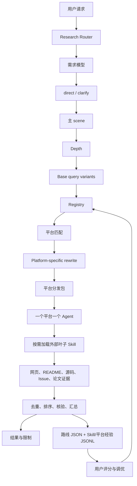
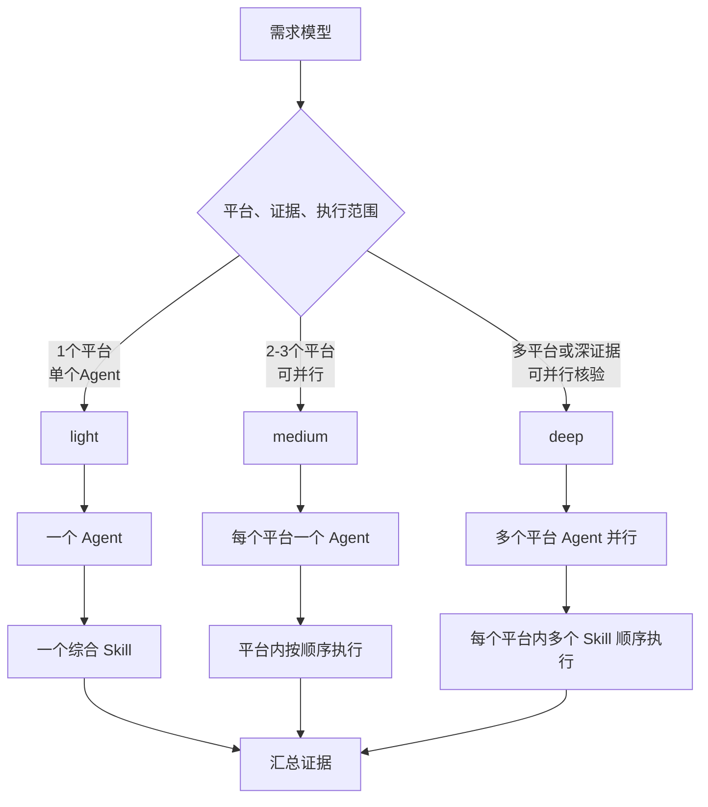
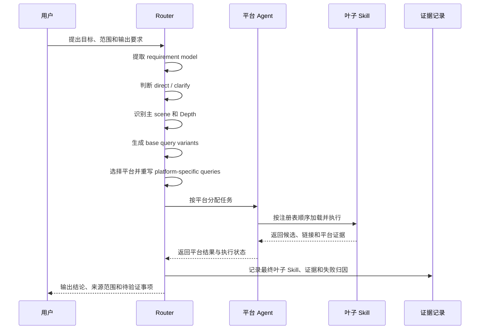

# Research Router

一个独立的 Codex Skill，用于把联网查询按“需求理解 → 交互模式 → 主场景 → Depth → 平台 → 子 Skill → 平台 Agent”组织起来。

它适合放在 Codex 或其他支持 `SKILL.md` 的 Agent 宿主中，作为联网调研的入口。Agent 负责理解需求、选择路径和生成查询，Router 负责读取 Registry、补全平台分发包、汇总证据和记录路线经验；平台访问优先使用仓库内置适配器，外部 Skill 只提供可选增强。

## 为什么需要它

长任务中最容易出现三类偏移：

1. 把用户的真实目标压缩成一个宽泛关键词，只搜索项目标题，漏掉 README、源码和 Issue 中的有效候选。
2. 没有区分快速初筛、跨平台比较和源码/全文核验，所有任务都走同样的深度，浪费时间和上下文。
3. 只报告“调用过某个 Skill”，没有记录最终实际使用的叶子 Skill、失败原因和用户评分，下一次无法调整路径。

Research Router 将这些决策固定成可阅读的注册表和参考规则。每次路由都可以回答：

```text
为什么判定为这个场景？
为什么使用这个深度？
为什么选择这些平台和 Skill？
实际运行到了哪个叶子 Skill？
证据来自哪里？哪里仍然没有验证？
```

它面向四类查询：

- **bug-fix**：查找报错解决方案、Issue、修复提交、源码和回归测试。
- **open-source**：发现和比较开源项目、Skill、插件及其实际实现。
- **academic**：发现论文、作者和会议，并在需要时核验论文正文或 PDF 证据。
- **community**：查找公开论坛中的讨论、实践报告和工具使用反馈。

## 一句话流程


```mermaid
flowchart LR
    A[用户原始请求] --> B[需求模型]
    B --> C[direct / clarify]
    C --> D[主 scene]
    D --> E[Depth]
    E --> F[Base query variants]
    F --> G[平台选择]
    G --> H[Platform-specific queries]
    H --> I[脚本 / Skill / CLI / MCP]
    I --> J[多平台 Agent 执行]
    J --> K[原始来源与证据]
    K --> L[去重、合并、实际 route]
```

## 设计原则

1. 由 Agent 先理解请求和相关对话上下文，构建 requirement model，再判断 direct / clarify、scene 和 depth。
2. Agent 负责语义拆分、指代继承、隐含目标、实体联想、查询扩展和平台专用查询重组；Python 只负责 Registry、别名归一、分发包补全、结构校验和适配器。
3. Depth 由平台范围、平台 Agent 数量、证据层级和执行范围决定；查询数量不决定 Depth。
4. 每个请求先生成 base query variants，平台确定后再做 platform-specific rewrite。
5. `light` 通常使用一个主要平台 Agent；`medium` 和 `deep` 在需要时并行多个平台 Agent。
6. 一个 Agent 负责一个平台。同一平台命中多个 Skill 时，由该 Agent 按顺序执行。
7. Router 只按需加载叶子 Skill，不扫描全部本地 Skill，不要求 MCP 作为直接依赖。
8. GitHub 的源码结论需要继续读取目录、源码、依赖、测试、Issue 和 Release；论文证据需要核对正文或 PDF。
9. 每次路由记录 requirement model、base queries、平台 queries、实际执行到的最终子 Skill、来源覆盖、停止原因和路线评分。

## 总体架构


```mermaid
flowchart TD
    U[用户请求] --> R[Research Router]
    R --> Q[需求模型]
    Q --> M[direct / clarify]
    M --> C[主 scene]
    C --> D[Depth]
    D --> G[Base query variants]
    G --> I[Registry]
    I --> P[平台匹配]
    P --> W[Platform-specific rewrite]
    W --> X[平台分发包]
    X --> A[一个平台一个 Agent]
    A --> S[按需加载外部叶子 Skill]
    S --> E[网页、README、源码、Issue、论文证据]
    E --> V[去重、排序、核验、汇总]
    V --> O[结果与限制]
    V --> T[路线 JSON + Skill/平台经验 JSONL]
    T --> F[用户评分与调优]
    F --> I
```

### Router 与叶子 Skill 的边界

| 组件 | 负责内容 | 不负责内容 |
| --- | --- | --- |
| Router | requirement model、场景判断、深度、base/platform queries、平台 Agent、去重、记录和调优入口 | 复制第三方 Skill、保存凭据、把静态注册当成运行成功 |
| 综合平台 Skill | 多个平台的搜索、读取和结果整理 | GitHub 源码级结论、论文正文证据的最终核验 |
| 平台专项 Skill | 某个平台的详情、评论、互动或特殊接口 | 替代 Router 的全局路径决策 |
| GitHub 分析 Skill | 目录、源码、依赖、测试、Issue、Release 和提交关系 | 仅凭标题或 README 下结论 |
| 学术核验 Skill | 元数据、正文、PDF 和引用位置核对 | 将搜索摘要直接当作论文结论 |

## 快速安装

将本仓库安装为 Codex Skill：

```bash
npx skills add sxyq/research-router --skill research-router
```

下载安装后，默认研究链即可工作，无需另外安装 AutoCLI、GitHub Skills、AnySearch 或 sibling Academic Skills。核心默认能力包括 GitHub 公开源码研究、Academic 发现与公开论文内容读取、Bilibili、V2EX、Discourse、52pojie，以及按站点域名做公开网页发现。

| 随仓库提供 | 可选增强 |
| --- | --- |
| GitHub API 搜索、README、树、选定源码、依赖/配置、测试、Issues、Releases、commits | `github-search`、`github-analyze`、`last30days-cn` |
| OpenAlex、Crossref、arXiv、Google Scholar 发现；作者/venue/年份/摘要；公开 HTML 论文段落 | `anysearch`、`paper-research-router`、`literature-evidence-audit`；已有 `pypdf` 时可读取下载的 PDF |
| Bilibili 搜索、V2EX 公开 API、Discourse 搜索、52pojie 公开读取、雪球公开端点 | AutoCLI 和其他平台专项 Skill 的额外详情 |
| 其他登记站点的免 Key 域名限定公开网页发现 | DDGS、Exa 等可扩展发现范围；YouTube 的 `yt-dlp` 字幕/详情；X 的 CLI/session |

核心脚本不自动安装软件、不登录平台、不读取浏览器 Cookie。GitHub REST 默认匿名访问；若 `GITHUB_TOKEN` 或 `GH_TOKEN` 已在环境中，适配器可选用该值；`gh` 只使用本机已有配置作为搜索补充。公开视频字幕、账号可见页面、付费 API 和桌面应用内容继续由用户本机已有的可选运行环境提供。

本地手动使用：

```bash
git clone https://github.com/sxyq/research-router.git "${CODEX_HOME:-$HOME/.codex}/skills/research-router"
```

安装后，在 Codex 中可以直接使用：

```text
使用 $research-router 先判断这个查询属于修 Bug、开源项目发现还是论文查询，再按合适深度执行，并记录最终调用的子 Skill。
```

## 自动更新

项目地址是 [https://github.com/sxyq/research-router](https://github.com/sxyq/research-router)。不要在普通路由开始时自动运行更新脚本。只有用户要求同步官方源码，且工作树状态已经确认后，才运行：

```bash
python3 scripts/update-skill.py --apply
```

脚本最多每七天访问一次 GitHub。达到间隔后，它读取官方仓库的最新提交并下载公开归档包，覆盖 Skill 自身的规则、注册表、参考资料和脚本；`records/`、`tuning/`、`.git` 和更新时间状态会保留。脚本不会启动后台进程，也不会读取 API Key、Cookie 或登录态。

常见返回状态如下：

| 状态 | 含义 |
| --- | --- |
| `cooldown` | 距离上次查询不足七天，继续使用当前版本。 |
| `up-to-date` | 已完成查询，当前版本已是最新。 |
| `updated` | 已覆盖更新，Agent 需要重新读取 `SKILL.md` 和相关注册表。 |
| `update-available` | 仅查询模式发现新版本；不覆盖受管文件，但会更新本地查询时间状态。 |
| `unavailable` | 网络或 GitHub 暂时不可用，继续使用当前版本并报告限制。 |

需要立即查询时运行：

```bash
python3 scripts/update-skill.py --force-check --apply
```

更新脚本只处理官方仓库内容；它不执行下载文件中的命令。开发者如果在 Skill 目录直接修改了受管文件，应先保留自己的提交或明确要求覆盖更新。

## 目录结构

```text
research-router/
├── SKILL.md                         # Codex 入口规则
├── agents/openai.yaml               # Codex 显示信息与默认提示
├── registry/                        # 内置平台和 Skill 注册表
│   ├── aliases.json                 # 平台别名归一化
│   ├── platforms.index.json         # 平台、场景和通用 Skill 索引
│   ├── search-components.index.json # 平台与免 Key 搜索组件索引
│   ├── skills.index.json            # Skill 总索引
│   ├── platform-domains.json        # 公开网页发现的域名与原生 provider
│   ├── platforms/*.json             # 平台能力和三档路由
│   └── skills/*.json                # Skill 来源、能力和边界
├── references/                      # 按需读取的详细路由规则
│   └── platform-index.md            # 平台级别、Skill、脚本和上游目录
├── schemas/                         # 路由、反馈、平台、Skill 和经验的 JSON Schema
├── records/                         # 本地运行记录，不提交到公开仓库
│   ├── routes/                      # 每次路由一个 JSON
│   ├── feedback/                    # 用户评分和意见
│   ├── experience/                  # 每个 Skill 和平台的 JSONL 经验
│   └── summaries/                   # 评分汇总
├── tuning/                          # 本地调优建议和已采用策略
├── scripts/                         # 确定性搜索、校验、评估和经验记录脚本
│   ├── route_plan.py                # Agent 计划的 Registry 解析和分发包补全
│   ├── fast_search.py               # 通用公开 discovery providers
│   ├── github_public.py              # GitHub 公开 API 检索和选定源码读取
│   ├── platform_discovery.py         # 域名限定的通用公开网页发现
│   ├── bilibili_public.py           # B站公开搜索
│   ├── v2ex_public.py               # V2EX公开 API读取
│   ├── xueqiu_public.py             # 雪球公开 HTTP读取
│   ├── academic-evidence/scripts/academic_public.py # 论文元数据和公开 HTML 证据
│   ├── update-skill.py              # 每七天一次的官方版本查询和覆盖更新
│   └── update-experience.py         # 从路线记录生成 Skill/平台经验
└── tests/                           # 固定路由案例，不访问真实平台
```

## 默认路由

入口 Skill 中直接保留当前已登记平台的快速索引；完整的平台级别、入口 Skill、脚本/适配器和上游候选目录见 [references/platform-index.md](references/platform-index.md)。当前分级为：一级 `github`、`academic`、`google-scholar`；二级包含 `52pojie`、`stackoverflow`、`linux-do`、`v2ex`、`discourse`、`youtube`、`twitter-x`；三级包含 Bilibili、Reddit、Xueqiu 和其他补充发现平台。52pojie 固定为二级。

| 平台 | Bundled light | Bundled medium | Bundled deep | 可选增强 |
| --- | --- | --- | --- | --- |
| GitHub | `github-local`: REST 检索与仓库字段；README 证据沿用源码获取顺序 | 复用 route snapshot；否则 shallow Git snapshot，再按需读取树、源码/配置/测试、Issues/Releases | 同一仓库一次临时 snapshot，多次本地读取；必要时 archive、已知路径 raw、有限 REST Contents | `github-search`、`github-analyze`、`last30days-cn`、已授权 `gh`/token |
| Academic / Google Scholar | `academic-local`: 公共文献发现 | 补作者、venue、日期、摘要与选定来源 | 加入公开 HTML 正文段落和跨来源核对 | `anysearch`、`paper-research-router`、`literature-evidence-audit` |
| Bilibili | `bilibili-public` 搜索 | 同一本地公开视频发现 | 更广查询与候选核对 | AutoCLI/last30days-cn；视频详情和字幕另需运行环境 |
| V2EX | `v2ex-public` | 同一本地公开 API，按需读取帖子/回复 | 增加查询和主题覆盖 | AutoCLI、last30days-cn |
| Discourse / Linux.do | `forum-search` 或已登记 endpoint | 搜索并读取选中主题 | 增加主题与回复范围 | 登录内容仍需可用账号会话 |
| 52pojie | `52pojie-research` | 扩大公开主题与 RSS 范围 | 读取相关公开回帖 | 无需额外 Skill |
| 其他登记站点 | `generic-platform-discovery` 域名限定发现 | 扩展互补查询和候选数 | 扩大站点覆盖 | AutoCLI、专项 Skill、DDGS 或 Exa |
| YouTube / Twitter-X | `generic-platform-discovery` 公共 URL 候选 | 更广站点发现 | 仍限公开页面 | YouTube rich metadata/subtitles 用 yt-dlp；X 原生检索需 CLI/session |

外部 Skill 均由 `optional_enhancements` 字段单独列出；它们缺失时继续执行 bundled Skill 和本地脚本，不把该平台标为失败。

## 免 Key 快速搜索

平台与搜索组件的完整对应关系见 [registry/search-components.index.json](registry/search-components.index.json) 和 [references/platform-index.md](references/platform-index.md)。本地脚本使用公开 HTTP 接口，不提示或写入凭据、不读取浏览器 Cookie，并只返回紧凑结果。GitHub 可选使用用户已设置的 `GITHUB_TOKEN` 或 `GH_TOKEN`，其余 provider 按各自 Registry 声明运行：

```bash
python3 scripts/github_public.py search --query "skill router" --limit 5
python3 scripts/github_public.py snapshot --repo owner/name
# Substitute the `root` value returned by snapshot for this example path.
python3 scripts/github_public.py local-tree --snapshot /temporary/path/repo
python3 scripts/github_public.py local-file --snapshot /temporary/path/repo --path src/main.py
python3 scripts/github_public.py repo --repo owner/name
python3 scripts/github_public.py cleanup --snapshot /temporary/path/repo
python3 scripts/fast_search.py --provider stackoverflow --query "python async http" --limit 5
python3 scripts/fast_search.py --provider openalex --query "agentic search" --limit 5
python3 scripts/fast_search.py --provider arxiv --query "tool use token efficiency" --limit 5
python3 scripts/fast_search.py --provider google-scholar --query "agentic search" --limit 5
python3 academic-evidence/scripts/academic_public.py metadata --arxiv 2401.12345
python3 academic-evidence/scripts/academic_public.py read --url https://arxiv.org/abs/2401.12345 --term "selected evidence concept"
python3 scripts/platform_discovery.py --platform reddit --query "agent research workflow"
```

`fast_search.py` 包含 Stack Exchange、Hacker News、Dev.to、Wikipedia、OpenAlex、Crossref、arXiv、Google Scholar、Discourse、RSS/Atom 和可选 `ddgs`；GitHub 由 `github_public.py` 提供结构化 REST 信息和选定文件兜底，源文件优先沿用 `github-local` 的多路径获取顺序。OpenAlex 与 Crossref 返回作者、venue、DOI 等公开字段和可用摘要，arXiv 返回 Atom 摘要与 HTML/PDF URL。Google Scholar 返回公开结果片段，遇到挑战页即停止。`academic_public.py` 可按 DOI/arXiv ID 取 metadata，也能读取公开 HTML 正文并提取 Agent 指定的段落。Exa 是可选的 no-key MCP 组件，但仍要求已有 MCP 配置。

GitHub 检索先用 bundled REST；无结果或请求失败时再尝试本机已装 `gh` 的现有配置，仍无候选时使用 `site:github.com` 公共发现。源文件获取顺序为已有 route snapshot、shallow Git snapshot、官方 archive、已知路径 `raw.githubusercontent.com`、有限 REST Contents。`snapshot` 会先尝试 shallow Git，再回退到官方 archive；深度路线对同一仓库只建立一个临时 snapshot，并在本地完成多次读取，路线结束时调用 `cleanup`。Git snapshot 只取一个提交、仅包含 8 MB 以内 blob，并要求 GitHub 报告仓库不超过 512,000 KiB；较大的仓库跳过 Git，改用受限 archive，再按需读取已知路径。`repo` 命令使用 REST README Contents 作为 light 读取捷径；需要源路径记录时，先建立/复用 snapshot，并在路线记录每个 GitHub 结果的 `retrieval_method`。REST 主要承担发现、结构化信息和选定文件兜底。REST 返回体上限 8 MB、正文输出上限 40,000 字符、树列表上限 5,000 项；archive 上限为压缩 64 MB、解压 256 MB、20,000 个文件且单文件 8 MB，raw 文件上限 8 MB。遇到截断、限流或访问失败时转下一个可用来源，仍无法读取就报告缺口。`gh` 与 token 不是默认条件，缺失时继续使用 bundled 路线。

建议的执行链是：

```text
平台专用 API
  -> 紧凑 JSON
  -> URL 去重
  -> Top-K 选择
  -> 选定页面正文读取
  -> 证据状态与路线记录
```

`platform_discovery.py` 为没有本地原生搜索 API 的登记站点提供 `site:domain` 公共网页发现，不需要 `ddgs`。这条能力用于找到公开候选链接，不等于平台原生搜索或登录内容读取。搜索服务可能拒绝或限流；脚本会返回 `partial`/`unavailable`。DDGS、SearXNG、Semantic Scholar、`trafilatura`、`readability-lxml` 和 Exa 都是可选增强项。

学术查询统一按下面的阶段推进：

```text
discovery -> selected papers -> paper-brief -> explicit full-audit
```

先用 Scholar、OpenAlex、arXiv 或 Crossref 找候选；选定论文后，通过 `academic_public.py` 取 metadata/摘要并读取公开 HTML 段落。arXiv HTML 可用时优先使用；出版方只提供 PDF 时，可用现有 PDF 脚本和环境中已安装的 `pypdf`，否则清楚说明缺口。不会自动安装 `pypdf`。`extract_paper_brief.py` 仍用于本地 PDF brief。

详细调用方式见 [references/search-components.md](references/search-components.md)。

小众技术论坛使用 `forum-search` 读取公开 Discourse JSON。当前目录中的 Rust Users、Kubernetes Discuss、Docker Community、NixOS Discourse 和 Home Assistant Community 已有公开端点记录；Lobsters、Hacker News、NodeSeek、HostLoc 等非 Discourse 站点不套用此适配器。详细范围见 [references/small-forums.md](references/small-forums.md)。

## 路线生命周期与平台 Agent 分发

平台索引是 Router 的分发入口。Router 先按需求选出平台，再为每个平台生成一个分发包：

```text
需求模型
  -> 平台/Skill 匹配
  -> 每个平台一个分发包
  -> 平台 Agent 按 Skill 顺序执行
  -> 主 Agent 合并来源、覆盖范围和失败
  -> 路线评分
  -> Skill/平台经验 JSONL
```

分发包包含平台 ID、级别、用户目标、平台专用查询词、证据要求、深度、Skill 顺序、脚本或适配器和停止条件。平台 Agent 只负责自己的平台，主 Agent 负责跨平台去重、证据合并和最终结论。`medium` 与 `deep` 可以并行平台 Agent；`light` 保持在主对话执行。

路线状态按 `planned`、`running`、`completed`、`partial`、`failed` 变化。每条路线记录 `router_path`、`executed_leaf_skills`、`source_coverage`、`stop_reason` 和 `route_evaluation`。

## 路线评估与经验记忆

路线评分关注问题覆盖度、证据直接性、时效性、来源去重、执行成本和未确认事项。详细字段见 [references/route-evaluation.md](references/route-evaluation.md)。

每次完成路线后，可以运行：

```bash
python3 scripts/update-experience.py records/routes/YYYY-MM-DD/<route>.json
python3 scripts/evaluate-route.py records/routes/YYYY-MM-DD/<route>.json
```

脚本会把执行过的 Skill 写入 `records/experience/skills/<skill>.jsonl`，把选定平台写入 `records/experience/platforms/<platform>.jsonl`，并以 `route_id + subject_id` 避免同一路线重复写入。经验记录只保留路由特征、来源覆盖、失败和评分，不保存原始正文、凭据或浏览器状态。

## 参考论文

经验机制参考 Zhong 等人的 *SkillLearnBench: Benchmarking Continual Learning Methods for Agent Skill Generation on Real-World Tasks*：

> Zhong, Shanshan, et al. “SkillLearnBench: Benchmarking Continual Learning Methods for Agent Skill Generation on Real-World Tasks.” arXiv:2604.20087, 2026.

- [论文摘要与版本信息](https://arxiv.org/abs/2604.20087)
- [arXiv DOI](https://doi.org/10.48550/arXiv.2604.20087)
- [SkillLearnBench 代码与任务](https://github.com/cxcscmu/SkillLearnBench)

本 Router 借鉴论文中的持续 Skill 学习、轨迹/结果分离和多任务稳定性思路，保留轻量的路线评估与经验记录；完整自动 Skill 生成、沙箱执行和复杂上下文图不属于当前 Router 的运行边界。

## 查询深度与 Agent 分工

Depth 先由平台范围、证据层级、平台 Agent 数量和执行范围决定，再生成查询词。查询数量用于记录实际覆盖，不反过来决定 Depth。用户明确的平台范围优先。


```mermaid
flowchart TD
    A[需求模型] --> B{平台、证据、执行范围}
    B -->|1个平台<br/>单个Agent| L[light]
    B -->|2-3个平台<br/>可并行| M[medium]
    B -->|多平台或深证据<br/>可并行核验| D[deep]
    L --> L1[一个 Agent]
    L1 --> L2[一个综合 Skill]
    M --> M1[每个平台一个 Agent]
    M1 --> M2[平台内按顺序执行]
    D --> D1[多个平台 Agent 并行]
    D1 --> D2[每个平台内多个 Skill 顺序执行]
    L2 --> E[汇总证据]
    M2 --> E
    D2 --> E
```

| 深度 | 默认分配 | Skill 处理方式 | Base query variants |
| --- | --- | --- | --- |
| `light` | 一个主要平台 Agent | 使用一个主要入口；只在有明确能力缺口时补充 fallback。 | 12–16+ |
| `medium` | 2–3 个相关平台 Agent | 不同平台可并行；同一平台内按顺序执行 Skill。 | 16–24+ |
| `deep` | 3–6 个相关平台 Agent | 多平台并行；继续读取源码、全文、评论链、metadata 或字幕。 | 20–30+，需要时增加 |

## 一次请求如何落地

以“寻找能按需求发现多个平台 Skill 的开源方案”为例，Router 的处理链路如下：


```mermaid
sequenceDiagram
    participant U as 用户
    participant R as Router
    participant A as 平台 Agent
    participant S as 叶子 Skill
    participant E as 证据记录
    U->>R: 提出目标、范围和输出要求
    R->>R: 提取 requirement model
    R->>R: 判断 direct / clarify
    R->>R: 识别主 scene 和 Depth
    R->>R: 生成 base query variants
    R->>R: 选择平台并重写 platform-specific queries
    R->>A: 按平台分配任务
    A->>S: 按注册表顺序加载并执行
    S-->>A: 返回候选、链接和平台证据
    A-->>R: 返回平台结果与执行状态
    R->>E: 记录最终叶子 Skill、证据和失败归因
    R-->>U: 输出结论、来源范围和待验证事项
```

如果用户选择 `clarify`，Router 在执行前逐个询问会改变范围、深度或证据要求的问题；如果用户选择 `direct`，Router 直接使用现有条件开始，缺少的信息在结果中明确标记。

## 两种交互模式

- `direct`：target 和 goal 已足够，按现有条件执行，缺失信息在结果中标记。
- `clarify`：只在缺少会改变主要 route 的条件时提问，一次一个问题，并更新 requirement model。

## 记录和调优

路由完成后，把记录写入：

```text
records/routes/YYYY-MM-DD/<timestamp>-<route-id>.json
```

记录至少包含：

- 查询摘要和必要上下文
- 场景、交互模式和深度
- 需求驱动的查询词
- 命中的平台与 Skill
- 每个平台的 Agent 和 Skill 执行顺序
- `router_path`、`source_coverage` 和 `stop_reason`
- 最终叶子 Skill 路径
- 证据状态、失败归因、来源链接和 `route_evaluation`

经验记录写入：

```text
records/experience/skills/<skill-id>.jsonl
records/experience/platforms/<platform-id>.jsonl
```

用户评分写入：

```text
records/feedback/YYYY-MM-DD/<timestamp>-<route-id>-feedback.json
```

Router 与子 Skill 分开评分。只有相似任务重复出现同一问题时，才生成 `tuning/proposals/` 中的调优建议；单次评分只作为样本。

### 记录示例

实际记录遵循 `schemas/route-record.schema.json`。下面只展示结构，不包含真实账号、Cookie 或原始搜索结果：

```json
{
  "route_id": "2026-09-05-open-source-001",
  "created_at": "2026-09-05T12:00:00Z",
  "requirement": {
    "target": "research-router alternatives",
    "goal": "compare open-source research routing implementations",
    "capabilities": ["repository discovery", "source and test review"],
    "context": [],
    "constraints": ["open source"],
    "evidence": ["README", "source", "tests", "Issues", "Releases"],
    "time": [],
    "explicit_platforms": ["github"]
  },
  "scene": "open-source",
  "interaction_mode": "direct",
  "depth": "medium",
  "depth_reason": "需要比较多个候选并核验项目实现",
  "query_variants": [
    "requirement-driven skill router README",
    "on-demand multi-platform agent skill loading",
    "skill routing feedback scoring source code"
  ],
  "router_path": [
    {"stage": "scene", "value": "open-source"},
    {"stage": "platform-selection", "platform_id": "github"},
    {"stage": "agent-dispatch", "platform_id": "github", "skill_ids": ["github-local"]},
    {"stage": "stop", "value": "completed"}
  ],
  "platforms": [
    {"platform_id": "github", "agent_id": "agent-github", "tier": 1, "depth": "medium", "queries": ["research-router alternatives source and tests"], "skill_order": ["github-local"], "scripts": ["scripts/github_public.py", "scripts/platform_discovery.py"], "search_components": ["github-public-multipath"], "retrieval_methods": ["rest", "git-shallow", "local-snapshot"], "optional_enhancements": ["github-search", "github-analyze", "last30days-cn"]}
  ],
  "matched_skills": [
    {"skill_id": "github-local", "reason": "读取候选仓库、选定源码、配置和测试"}
  ],
  "executed_leaf_skills": ["github-local"],
  "final_leaf_skills": ["github-local"],
  "source_coverage": {
    "status": "partial",
    "requested": ["repository source", "tests"],
    "covered": ["repository source"],
    "missing": ["tests"],
    "source_count": 3,
    "direct_source_count": 2,
    "recency_score": 8
  },
  "stop_reason": "completed",
  "status": "partial",
  "route_evaluation": {
    "problem_coverage": 8,
    "evidence_directness": 9,
    "recency": 8,
    "deduplication": 10,
    "execution_cost": {"query_count": 3, "skill_calls": 2, "agent_count": 1},
    "unconfirmed_items": ["tests"],
    "overall": 8.75,
    "method": "manual"
  },
  "user_feedback": null
}
```

`final_leaf_skills` 只写实际执行到的叶子 Skill；注册表中命中但因深度、重复或平台不可用而没有执行的候选，保留在其他字段或失败说明中。

### 评分维度

每个 Router 或子 Skill 按 0–10 分记录以下维度，汇总分只用于排序和调优，不代表第三方项目一定运行成功：

| 维度 | 权重 | 关注点 |
| --- | ---: | --- |
| `F` 功能覆盖 | 25% | 是否覆盖用户目标和实际任务能力。 |
| `R` 路由适配 | 20% | 场景、平台、深度、边界和重复处理是否合适。 |
| `E` 执行证据 | 20% | 是否有源码、脚本、适配器、测试或真实运行证据。 |
| `V` 验证质量 | 15% | 来源、结果确认、失败状态和可复查性。 |
| `S` 安全与稳定 | 20% | 权限边界、登录态处理、失败停止和维护情况。 |

计算方式：`F×25% + R×20% + E×20% + V×15% + S×20%`。

## 校验

```bash
python3 scripts/validate-registry.py
python3 scripts/validate-route-record.py path/to/route.json
python3 scripts/evaluate-route.py path/to/route.json
python3 scripts/summarize-feedback.py
python3 "${CODEX_HOME:-$HOME/.codex}/skills/.system/skill-creator/scripts/quick_validate.py" .
```

`tests/routing-cases/basic-cases.json` 收录 Research Router Agent 的语义行为预期，包括上下文继承和查询规划。它们不是正则或关键词解析器的自动测试；Python 测试只校验案例文件结构和确定性代码，不判断 Agent 的语义答案。

YouTube 或 Twitter/X 被选中时，只探测该平台的本机 runtime：

```bash
python3 scripts/probe_runtime.py --platform youtube
python3 scripts/probe_runtime.py --platform twitter-x
```

Probe 只查询登记的可执行文件和安全的版本命令。它不发起搜索、不登录、不读取浏览器 Cookie，也不启动 OpenCLI daemon。发现可执行文件不代表平台搜索已经验证。

## 隐私边界

公开仓库不包含：

- 浏览器 Cookie、Token 或账号数据
- 原始查询结果和大段上下文
- 本地运行记录与评分记录
- Trellis 文件或项目源码
- MCP 配置

运行记录和调优文件通过 `.gitignore` 保留在本机 Skill 目录，供后续调整路由时使用。

## 状态

这是一个随仓库包含核心公开研究能力的 Skill。GitHub、Academic、Bilibili、V2EX、Discourse、52pojie 和泛站点公开候选发现都走 bundled 路径；外部 Skill、CLI、MCP 与账号会话仅扩展覆盖范围。公开接口和匿名额度会随服务状态变化，调用结果始终按实际 `status` 报告。
